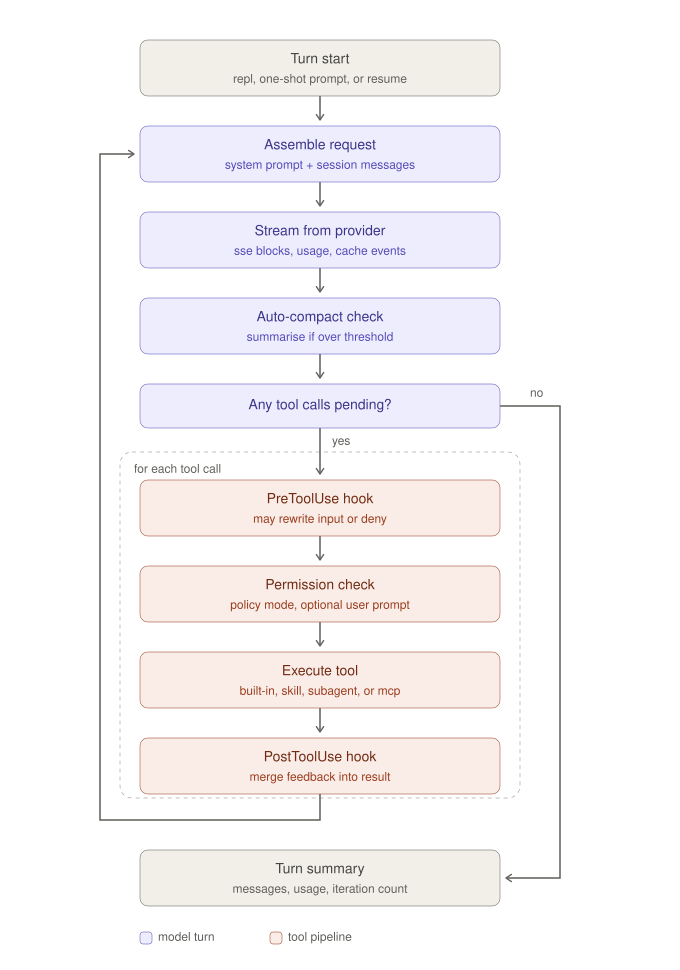

# Architecture

What each stage of the agentic loop does, in execution order.

Every section names the Python file in this repo and the Rust file in
`ultraworkers/claw-code` it was derived from, so you can read either side by side.

<p align="center">
  
</p>

**Contents**

- [The shape of the thing](#the-shape-of-the-thing)
- [Stage 1 — Turn start](#stage-1--turn-start)
- [Stage 2 — Assemble request](#stage-2--assemble-request)
- [Stage 3 — Stream from provider](#stage-3--stream-from-provider)
- [Stage 4 — Auto-compact check](#stage-4--auto-compact-check)
- [Stage 5 — Any tool calls pending?](#stage-5--any-tool-calls-pending)
- [Stage 6 — PreToolUse hook](#stage-6--pretooluse-hook)
- [Stage 7 — Permission check](#stage-7--permission-check)
- [Stage 8 — Execute tool](#stage-8--execute-tool)
- [Stage 9 — PostToolUse hook](#stage-9--posttooluse-hook)
- [Stage 10 — Loop back](#stage-10--loop-back)
- [Stage 11 — Turn summary](#stage-11--turn-summary)
- [Cross-cutting: tracing and replay](#cross-cutting-tracing-and-replay)
- [Subagents](#subagents)
- [Multi-provider routing](#multi-provider-routing)
- [MCP tools](#mcp-tools)
- [Session persistence and resume](#session-persistence-and-resume)
- [Parallel tool dispatch](#parallel-tool-dispatch)
- [Three design decisions worth stealing](#three-design-decisions-worth-stealing)
- [Still missing](#still-missing)

---

## The shape of the thing

An agent harness is, structurally, one `while` loop with a gate in the middle.

The loop asks a model what to do, does it, tells the model what happened, and
asks again — until the model stops asking for things. Everything interesting is
in the gate: what gets to run, who can veto it, and what the model is told when
something is refused.

Two properties are worth holding in mind as you read:

1. **The model never sees the machinery.** It sees a system prompt, a message
   history, and tool results. It does not know a hook rewrote its arguments or
   that a policy denied a call — it only sees the resulting text.
2. **Nothing in the tool pipeline raises.** Denials and failures both come back
   as tool results with `is_error: true`. The model reads them and adapts. The
   only thing that aborts a turn is the iteration cap or a provider failure.

---

## Stage 1 — Turn start

**Python:** `claw_py/conversation.py` → `run_turn`, opening block
**Rust:** `runtime/src/conversation.rs`

Before anything else, a guard runs — but only if this session has been compacted
before:

```python
if self.session.compaction is not None:
    try:
        self.run_session_health_probe()
    except Exception as error:
        raise RuntimeError(
            f"Session health probe failed after compaction: {error}. "
            "The session may be in an inconsistent state. "
            "Consider starting a fresh session."
        )
```

The Rust source calls this the **session-health canary**. The reasoning: compaction
rewrites message history in place. A malformed rewrite doesn't fail loudly — it
quietly poisons every subsequent request in the session. It's far cheaper to
detect that once, at the start of the next turn, than to debug it later.

The probe itself is deliberately cheap: confirm the history isn't empty, confirm
every role is one of `user` / `assistant` / `tool`, and confirm every message
still serialises to the wire format.

Then two bookkeeping steps:

```python
self.record_turn_started(user_input)
self.session.push_user_text(user_input)
```

The first emits a trace event. The second appends the user's message to
`session.messages`.

---

## Stage 2 — Assemble request

**Python:** `claw_py/conversation.py`, `claw_py/prompt.py`
**Rust:** `runtime/src/conversation.rs`, `runtime/src/prompt.rs`

Request construction is deliberately thin:

```python
request = ApiRequest(
    system_prompt=self.system_prompt,
    messages=list(self.session.messages),
)
```

**The entire history is copied on every iteration.** There is no incremental
append to a wire buffer. This is the single biggest cost driver in the loop, and
it is exactly why Stage 4 exists.

The `system_prompt` was built once at startup, not per iteration.
`prompt.build_system_prompt` walks from the working directory up to the git root
(or stops at cwd if there isn't one) and collects instruction files in priority
order:

1. `CLAUDE.md`
2. `CLAW.md`
3. `AGENTS.md`
4. scoped variants under `.claw/` and `.claude/`

Every non-duplicate file found contributes to the rendered prompt. Files closer
to the working directory are appended later, so they read as refinements of the
broader project instructions.

---

## Stage 3 — Stream from provider

**Python:** `claw_py/api.py` → `ApiClient.stream`, `build_assistant_message`
**Rust:** `api/src/providers/`

Two functions, cleanly split:

`ApiClient.stream()` opens the HTTP connection and yields normalised events:

| Event | Meaning |
|---|---|
| `text_delta` | A chunk of assistant prose |
| `tool_use` | The model wants to call a tool |
| `usage` | Token counts, emitted once at the end |
| `message_stop` | Stream complete |

`build_assistant_message()` folds that stream into a single
`ConversationMessage` plus an optional `Usage` record. It also strips `<think>`
blocks, which small reasoning models emit and which shouldn't reach the user.

The fold produces a list of `ContentBlock`s, and this is the branch point of the
entire loop:

```python
pending_tool_uses = [
    (block.id, block.name, block.input)
    for block in assistant_message.tool_uses()
]
```

The model's decision to keep working or to stop is *just whether that list is
empty*. There is no separate "am I done" signal, no stop token to interpret, no
completion classifier. The absence of tool calls is the completion signal.

The assistant message is pushed to the session **immediately**, before any tool
runs. If a tool later fails, the model's request to call it is already in the
history, so the failure has context.

---

## Stage 4 — Auto-compact check

**Python:** `claw_py/compact.py`, `conversation.maybe_auto_compact`
**Rust:** `runtime/src/compact.rs`

This runs *after* the assistant message is appended and *before* the tool-use
branch is evaluated. That placement is deliberate and load-bearing. The Rust
source carries a comment explaining it: compaction must also run on the terminal
no-tool iteration, or history grows without bound **across** turns rather than
within them.

Three functions:

```python
estimate_session_tokens(session)   # len(chars) // 4 — cheap, good enough
should_compact(session, config)    # compare against threshold
compact_session(session, config, summarize)
```

`compact_session` splits the history, asks the model to summarise the older
portion, and replaces it with that summary plus a continuation message. It never
splits in the middle of an assistant/tool-result pair — that would orphan a tool
result and confuse the model on the next request.

The `summarize` callable is injected rather than imported, so `compact.py` has no
dependency on the provider. That makes it trivially testable, and the test suite
does exactly that.

If compaction fires, a `CompactionRecord` is stored on the session (which is what
arms the Stage 1 health probe on the next turn) and carried into the turn summary
so the caller can surface it.

---

## Stage 5 — Any tool calls pending?

**Python:** `claw_py/conversation.py`
**Rust:** `runtime/src/conversation.rs`

Literally one line:

```python
if not pending_tool_uses:
    break
```

No tools means the model produced its final answer. The loop exits and Stage 11
builds the summary.

Separately, at the *top* of each iteration, the runaway guard:

```python
iterations += 1
if iterations > self.max_iterations:
    error = RuntimeError("conversation loop exceeded the maximum number of iterations")
    self.record_turn_failed(iterations, error)
    raise error
```

This is the circuit breaker. Small open-weights models hit it regularly — they'll
happily call `read_file` on the same path twenty times. The cap turns an infinite
loop and an unbounded bill into a clean, traced failure.

---

## Stage 6 — PreToolUse hook

**Python:** `claw_py/hooks.py`, `conversation._run_tool_call`
**Rust:** `runtime/src/hooks.rs`

**This is the most powerful stage in the system, and the one most worth
understanding.** A `PreToolUse` hook can do three distinct things:

**1. Rewrite the arguments.**

```python
effective_input = pre_hook_result.updated_input()
if effective_input is None:
    effective_input = dict(input)
```

Whatever the hook returns becomes what actually executes. The model is never told
its input was changed. Useful for injecting defaults, scoping paths, or
normalising sloppy arguments from a small model.

**2. Inject a permission override.**

```python
permission_context = PermissionContext(
    permission_override=pre_hook_result.permission_override(),
    permission_reason=pre_hook_result.permission_reason(),
)
```

The policy in Stage 7 checks this *first*, before its own mode logic. A hook can
therefore authorise something the configured mode forbids.

**3. Short-circuit entirely.**

```python
if pre_hook_result.is_cancelled():
    permission_outcome = PermissionOutcome.Deny(...)
elif pre_hook_result.is_failed():
    permission_outcome = PermissionOutcome.Deny(...)
elif pre_hook_result.is_denied():
    permission_outcome = PermissionOutcome.Deny(...)
else:
    permission_outcome = self.permission_policy.authorize_with_context(...)
```

Note the `else`. If a hook short-circuits, **the permission policy never runs at
all**.

> **The consequence:** hooks outrank permission modes in both directions. A hook
> can veto what the mode allows *and* allow what the mode forbids. If you are
> hardening a system built on this design, hooks are the real trust boundary —
> the modes are a convenience layer on top of them.

---

## Stage 7 — Permission check

**Python:** `claw_py/permissions.py` → `PermissionPolicy.authorize_with_context`
**Rust:** `runtime/src/permissions.rs`

Five modes, checked in this order: hook override → allowlist → mode.

| Mode | Behaviour |
|---|---|
| `read-only` | Denies `write_file`, `edit_file`, `bash`. Everything else allowed. |
| `workspace-write` | **Default.** Writes allowed inside the workspace root only; `bash` requires approval. |
| `danger-full-access` | Allows everything, no questions. |
| `prompt` | Every tool call requires approval. |
| `allow` | Allows everything. |

The escalation path is the interesting part:

```python
def _escalate(self, tool_name, effective_input, prompter):
    # No prompter means non-interactive: deny rather than silently allow.
    if prompter is None:
        return PermissionOutcome.Deny(
            f"`{tool_name}` needs approval but no prompter is attached"
        )
    if prompter.confirm(tool_name, effective_input):
        return PermissionOutcome.Allow()
    return PermissionOutcome.Deny(f"user declined `{tool_name}`")
```

`prompter` is `None` in one-shot and JSON-output modes and present in the
interactive REPL. **When there is nobody to ask, the answer is no.** That's the
mechanism behind flags like `--dangerously-skip-permissions` in the original: the
dangerous thing isn't skipping the prompt, it's changing the mode so the prompt is
never reached.

A denial is not an exception. It becomes a tool result:

```python
return ConversationMessage.tool_result(
    tool_use_id, tool_name,
    merge_hook_feedback(pre_hook_result.messages(), permission_outcome.reason, True),
    True,
)
```

The model reads *"`/etc/passwd` is outside the workspace root"* on its next
iteration and can try something else. This is what makes a restrictive policy
usable rather than merely obstructive.

---

## Stage 8 — Execute tool

**Python:** `claw_py/tools.py` → `ToolExecutor.execute`
**Rust:** `tools/src/lib.rs`

Dispatch by name over a registry. This repo ships seven tools: `read_file`,
`write_file`, `edit_file`, `glob_search`, `grep_search`, `bash`, `todo_write`.

The error handling is the design point:

```python
try:
    output = self.tool_executor.execute(plan.tool_name, plan.effective_input)
    is_error = False
except Exception as error:
    output = str(error)
    is_error = True
```

**A tool failure is data, not an exception.** The error text becomes the tool's
output with `is_error: true`, goes into the history, and the model sees it next
iteration. A model that tries to read a nonexistent file gets told so and can
`glob_search` instead — no human intervention, no crash.

`ToolExecutor.register()` is also the extension seam. Anything that produces a
`ToolSpec` — an MCP-bridged tool, a plugin, a subagent — registers here and
inherits the identical hook and permission path as the built-ins. That single
choke point is the property that makes the whole design worth copying.

Each `ToolSpec` also declares a `risk` (`read` / `write` / `escalate`), which
drives both the permission default and whether the call is eligible to run
concurrently. See [MCP tools](#mcp-tools) and
[Parallel tool dispatch](#parallel-tool-dispatch).

---

## Stage 9 — PostToolUse hook

**Python:** `claw_py/hooks.py`, `conversation._run_tool_call`
**Rust:** `runtime/src/hooks.rs`

Two different hooks fire depending on outcome:

```python
if is_error:
    post_hook_result = self.run_post_tool_use_failure_hook(...)
else:
    post_hook_result = self.run_post_tool_use_hook(...)
```

That split lets you attach a formatter to successful writes and a diagnostic to
failed ones without either checking the other's condition.

A post-hook can also **flip a successful tool into an error**:

```python
post_rejected = (
    post_hook_result.is_denied()
    or post_hook_result.is_failed()
    or post_hook_result.is_cancelled()
)
if post_rejected:
    is_error = True
```

This is how you build a post-hoc validation gate — run a linter on written code,
reject output that fails schema validation, catch a `bash` command that succeeded
but produced something unacceptable.

Finally `merge_hook_feedback` splices hook commentary into the output the model
sees, prefixed as `[hook note]` or `[hook error]`, and the result is packed into a
`tool_result` message and appended to the session.

---

## Stage 10 — Loop back

Control returns to Stage 2. The session now contains the user message, the
assistant message, and one tool result per call — all of which get copied into
the next request.

This is why Stage 4's placement matters. A ten-iteration tool-heavy turn adds a
lot of history before the turn ever ends, and the compaction check is the only
thing standing between that and an unbounded context.

---

## Stage 11 — Turn summary

```python
summary = TurnSummary(
    assistant_messages=assistant_messages,
    tool_results=tool_results,
    iterations=iterations,
    usage=self.usage_tracker.cumulative_usage(),
    auto_compaction=auto_compaction,
)
self.record_turn_completed(summary)
```

Everything the caller needs to render the turn, bill for it, or decide whether to
warn the user that history was compacted.

---

## Cross-cutting: tracing and replay

**Python:** `claw_py/telemetry.py`
**Rust:** `telemetry/src/lib.rs`

Every stage has a paired `record_*` call:

```
record_turn_started
record_assistant_iteration
record_tool_started
record_tool_finished
record_turn_completed
record_turn_failed
```

The important property is that these are **emitted inline with execution**, not
reconstructed afterwards from logs. A session transcript is therefore sufficient
on its own to replay a turn deterministically — you don't need to correlate
across sources or infer ordering from timestamps.

```bash
python -m claw_py.cli --trace trace.jsonl "find every TODO comment"
```

```jsonl
{"ts": 1234.5, "session_id": "a1b2", "kind": "turn_started", "chars": 24}
{"ts": 1236.1, "session_id": "a1b2", "kind": "assistant_iteration", "iteration": 1, "pending_tool_uses": 1}
{"ts": 1236.2, "session_id": "a1b2", "kind": "tool_started", "iteration": 1, "tool_name": "grep_search"}
{"ts": 1236.4, "session_id": "a1b2", "kind": "tool_finished", "iteration": 1, "is_error": false}
```

Of everything in this codebase, this is the piece most worth lifting wholesale
into other systems. It costs almost nothing and it's very hard to retrofit.

---

## Subagents

**Python:** `claw_py/agents.py`
**Rust:** `execute_agent` / `allowed_tools_for_subagent` in `tools/src/lib.rs`

A subagent is **not a special mechanism**. It is an ordinary tool, registered in
the same `ToolExecutor`, gated by the same hooks and the same policy. Its handler
just happens to build a nested `ConversationRuntime`.

That framing is the whole design. Because delegation is a tool, it cannot bypass
anything — the gate in Stage 6-9 applies to `agent` exactly as it applies to
`bash`.

### Why delegate at all

Look at what the demo prints:

```
ok  agent   [explore-1a4d6d] map the package (4 iteration(s), 3 tool call(s))

INSIDE THE SUBAGENTS (from the trace)
  explore-1a4d6d  spawned at depth 1  tools=glob_search,grep_search,read_file
  explore-1a4d6d  ok     glob_search
  explore-1a4d6d  ok     read_file
  explore-1a4d6d  ok     grep_search
```

The subagent ran four iterations and three tool calls. The parent's history grew
by **one tool result containing one paragraph**.

That is the entire economic argument for subagents. Recall from Stage 2 that the
full history is re-sent on every iteration — so an exploration that costs 3 tool
results in the parent costs those 3 results *on every subsequent request for the
rest of the session*. Push it into a subagent and you pay for it once, inside a
context window you then throw away.

### The five guarantees

```python
runtime = ConversationRuntime(
    api_client=config.client_factory(config.subagent_model),
    tool_executor=tool_executor,
    permission_policy=PermissionPolicy(
        mode=narrower_mode(config.parent_mode, spec.mode),   # 2
        workspace_root=config.workspace_root,
        allowed_tools=allowed_tools,                          # 1
    ),
    system_prompt=build_agent_system_prompt(...),
    session=Session(session_id=agent_id),                     # 4
    hook_registry=config.hook_registry,                       # 3
    session_tracer=tracer,
    max_iterations=spec.max_iterations,                       # 5
)
summary = runtime.run_turn(prompt, prompter=None)             # 6
```

**1. Restricted tools, enforced twice.** The allowlist goes into
`PermissionPolicy(allowed_tools=...)` *and* filters what is offered to the model
via `wire_specs(offered)`. The model is not tempted by a tool it cannot use, and
if it calls one anyway the policy refuses. Belt and braces, deliberately — a
small model will invent tool names.

**2. A subagent never gains authority.** `narrower_mode` takes the minimum of the
parent's mode and the spec's:

```python
MODE_RANK = {READ_ONLY: 0, PROMPT: 1, WORKSPACE_WRITE: 2, ALLOW: 3, DANGER_FULL_ACCESS: 4}
```

A `verification` agent wants `workspace-write`, but if the parent is `read-only`
it gets `read-only`. Authority only ever narrows going down the tree.

**3. Hooks are inherited, not reset.** The subagent gets the parent's
`HookRegistry`. A hook that blocks `rm -rf` at the top blocks it three levels
down. If subagents got a fresh registry, delegation would be a privilege
escalation path.

**4. A fresh `Session`.** This is what produces the isolation in the demo.

**5. A lower iteration cap, and no human.** `spec.max_iterations` is per-type
(8-12). And `prompter=None` — a subagent **cannot escalate to the user**, because
there is nobody watching it. Any tool needing approval is denied. The system
prompt says so explicitly, so the model does not waste turns asking.

### The five types

| Type | Tools | Mode | For |
|---|---|---|---|
| `explore` | read, glob, grep | `read-only` | Searching a codebase |
| `plan` | read, glob, grep, todo | `read-only` | Turning a goal into steps |
| `verification` | read, glob, grep, bash | `workspace-write` | Checking a claim holds |
| `general-purpose` | everything | `workspace-write` | Self-contained tasks |

`normalize_subagent_type` accepts aliases and casing (`Explorer` → `explore`,
`general_purpose` → `general-purpose`) because small models are inconsistent
about enum values, and rejects anything unrecognised with a `ToolError` listing
the valid options — which the model reads and corrects on its next iteration.

### Depth limiting

The `agent` tool is simply **not registered** at the ceiling:

```python
def build_tool_executor(config: AgentConfig, depth: int) -> ToolExecutor:
    executor = default_tool_executor()
    if depth < config.max_depth:
        executor.register(make_agent_tool(config, depth + 1))
    return executor
```

Structural rather than checked: at max depth the tool does not exist, so it
cannot be called. `execute_agent` also checks depth defensively, in case a tool
is registered by another path. `--max-agent-depth 0` disables delegation
entirely.

### Failure containment

```python
try:
    summary = runtime.run_turn(prompt, prompter=None)
except Exception as error:
    tracer.emit("subagent_failed", depth=depth, error=str(error))
    raise ToolError(f"subagent `{agent_id}` failed: {error}") from error
```

A subagent blowing its iteration cap raises `RuntimeError` internally — but that
is caught and re-raised as `ToolError`, which Stage 8 converts into an
`is_error` tool result. **A failed subagent does not fail the parent's turn.**
The parent reads "subagent explore-6f4c6e failed: exceeded the maximum number of
iterations" and decides what to do next. This is Stage 8's failure-is-data rule
applied recursively.

---

## Multi-provider routing

**Python:** `claw_py/routing.py`

`RoutedApiClient` is a **drop-in replacement for `ApiClient`**. Same `stream()`
contract, same four event types. Nothing above it knows which provider answered.

```bash
pip install litellm
python -m claw_py.cli --router litellm --model local-fast "..."
```

### Roles, not models

```python
DEFAULT_ROUTES = {
    "local-fast": [Route("ollama/qwen3:4b", api_base="..."),
                   Route("ollama/llama3.1:8b", api_base="...")],
    "local-deep": [Route("ollama/qwen3:14b", api_base="..."), ...],
    "frontier":   [Route("anthropic/claude-sonnet-4-6"),
                   Route("openai/gpt-4.1")],
}
```

A caller asks for `local-fast`, not for a model. Each role is an **ordered
fallback chain**; `stream()` walks it and only raises once every route has
failed, with all the errors collected:

```
every route for `frontier` failed:
  anthropic/claude-sonnet-4-6: <error>
  openai/gpt-4.1: <error>
```

### Where it earns its keep

Because `AgentConfig.client_factory` is what builds every runtime, parent and
subagents can sit on different tiers:

```bash
python -m claw_py.cli --router litellm --model frontier --subagent-model local-fast
```

A strong model plans and decides; a cheap local one does the grepping. That
combination is the usual reason to want routing, and here it is one flag —
because `execute_agent` calls `config.client_factory(config.subagent_model)`
rather than constructing a client itself.

### The fiddly part

Streaming tool calls arrive **fragmented**. The function name comes in one chunk,
the JSON arguments dribble across several, and parallel calls interleave:

```
chunk 1: tool_calls[0] id=call_a name=read_file arguments='{"pa'
chunk 2: tool_calls[0]                          arguments='th": "alpha'
chunk 3: tool_calls[1] id=call_b name=grep      arguments='{"pattern"'
chunk 4: tool_calls[0]                          arguments='.py"}'
```

`_decode` accumulates by `index` and emits each call only once the stream ends:

```python
slot = pending.setdefault(index, {"id": "", "name": "", "arguments": ""})
if function.name:      slot["name"] = function.name
if function.arguments: slot["arguments"] += function.arguments
```

Malformed JSON becomes `{"_raw": ...}` rather than raising — the tool then fails
schema validation and the model gets told, which is the right failure mode for a
small model that emits broken arguments. Tests in `tests/test_agents.py` cover
all of this without needing litellm installed.

---

## MCP tools

**Python:** `claw_py/mcp.py`
**Rust:** `runtime/src/mcp_tool_bridge.rs`

An MCP server is a subprocess speaking JSON-RPC 2.0 over newline-delimited
stdin/stdout. `McpClient` spawns it, runs the handshake, lists its tools, and
`bridge_mcp_tool` wraps each one as an ordinary `ToolSpec`:

```python
def bridge_mcp_tool(client, tool, risk=RISK_ESCALATE) -> ToolSpec:
    def handler(input):
        return client.call_tool(tool.name, input)
    return ToolSpec(
        name=tool.qualified_name,          # mcp__{server}__{tool}
        description=f"[{tool.server}] {tool.description}",
        input_schema=normalize_schema(tool.input_schema),
        handler=handler,
        risk=risk,
    )
```

**That is the entire integration.** Once it is a `ToolSpec` it enters the same
registry as `read_file` and takes the same path through Stages 6-9. There is no
`if is_mcp_tool` anywhere in `conversation.py` — which is precisely the property
you want, because remote tools are the ones you least want skipping a gate.

The demo shows it: a bridged tool is denied without a prompter, allowed with
one, and a hook can veto it. Identical behaviour to `bash`.

### Risk classification, and why it had to change

The permission policy originally classified tools by hardcoded name:

```python
WRITE_TOOLS = {"write_file", "edit_file", "bash"}
```

That cannot classify `mcp__github__create_issue`. Worse, it *fails open* — an
unrecognised name fell through to `Allow()`, so bridging MCP tools would have
silently auto-approved every remote tool under `workspace-write`.

So `ToolSpec` now declares its own risk, and the policy consults it:

```python
RISK_READ      # idempotent, no side effects, safe to run concurrently
RISK_WRITE     # mutates the workspace; runs in order
RISK_ESCALATE  # needs explicit approval
```

`ToolExecutor.risk_for()` returns `RISK_ESCALATE` for unknown tools — **failing
closed**. Bridged MCP tools default to `RISK_ESCALATE` too, so under
`workspace-write` a remote tool always requires approval. Override per server
with `"risk": "read"` in the config if you trust it.

The policy still falls back to the old name sets when no `risk_lookup` is
supplied, so nothing that existed before changed behaviour.

### Server lifecycle

`McpServerManager` starts every configured server and returns the combined
specs. A server that fails to start is recorded in `.failures` and **skipped** —
one broken server degrades the tool list rather than preventing startup.

Configuration is the familiar `.mcp.json` shape:

```json
{"mcpServers": {"echo": {"command": "python", "args": ["server.py"]}}}
```

Two details worth noting. `McpClient.request` holds a lock, because parallel
dispatch can call two tools on one server concurrently and JSON-RPC responses
must stay matched to their requests — there is a test that hammers this with
eight threads. And stderr is drained on a background thread into a 50-line ring
buffer, so a server that dies mid-session produces a diagnosable error instead
of a silent hang.

---

## Session persistence and resume

**Python:** `claw_py/persistence.py`

This is the one place the design **deliberately diverges** from the original.

claw-code serialises session state to its own `.jsonl` file, separate from its
telemetry stream. That means two sources of truth that can disagree — and in
practice, a session file that says one thing while the trace says another is
very unpleasant to debug.

Here, **the trace is the store**. `SessionTracer` already emitted an event at
every point the session changed; adding the message content to those events
makes the trace a complete ordered log:

```python
def record_message_appended(self, message: ConversationMessage) -> None:
    self.session_tracer.emit("message_appended", message=serialize_message(message))
```

Called at exactly the three points a message enters the session: the user turn,
each assistant message, and each tool result.

Resuming is then a **fold over the log**, not a deserialisation:

```python
for event in read_events(path):
    if event.get("session_id") != session_id:
        continue
    if event["kind"] == "message_appended":
        messages.append(deserialize_message(event["message"]))
    elif event["kind"] == "auto_compaction":
        messages = [get_compact_continuation_message(summary), *messages[dropped:]]
```

Three properties fall out of this for free:

**1. A resumed session cannot disagree with its own trace**, because they are
the same artifact.

**2. Compaction replays as an operation, not a result.** The event records how
many messages were dropped and the summary that replaced them; replay applies
*exactly the transformation `compact_session` applied*. No compacted state is
ever stored — only the instruction that produced it.

**3. A truncated trace still resumes.** `read_events` skips an unparseable final
line, so a process killed mid-write resumes to its last consistent point. There
is a test that appends `{"ts": 1, "kind": "message_app` and asserts the replay
is still complete.

Subagents share the trace file but have their own `session_id`, so filtering
gives isolation for free — and because `subagent_started` records its `parent`,
a whole delegation tree reconstructs in one pass:

```bash
python -m claw_py.cli --trace t.jsonl --list-sessions
```

```
session        turns  msgs  cmpt  first prompt
179425a9acc3       1     4     0  summarise my notes
```

---

## Parallel tool dispatch

**Python:** `claw_py/conversation.py` → `_dispatch_tool_plans`

Stage 8 originally ran pending calls in a simple loop. Making that concurrent
safely required splitting the pipeline into three phases:

| Phase | What | Concurrency |
|---|---|---|
| 1. Authorize | PreToolUse hook + permission check | **sequential** |
| 2. Execute | run the tool | **batched parallel** |
| 3. Finalize | PostToolUse hook + build result | **sequential** |

Phase 1 must stay serial for two reasons: hook ordering has to be deterministic,
and **only one permission prompt can be in front of the user at a time**. Two
threads racing for stdin is not a user experience anyone wants. Phase 3 stays
serial so results land in request order regardless of completion order.

### Batching, not partitioning

The obvious implementation — run all reads concurrently, all writes after — is
wrong. It lets a write overtake a read the model requested *before* it, which
silently reorders the model's intent.

Instead, `_dispatch_tool_plans` groups **runs of consecutive parallel-safe
calls**:

```python
for index, plan in enumerate(plans):
    if not plan.permission_outcome.allowed:
        flush(); results[index] = denied(plan); continue
    if self.parallel_tools > 1 and self._is_parallel_safe(plan):
        batch.append(index)
    else:
        flush()
        results[index] = self._execute_tool_plan(iterations, plan)
flush()
```

`[read, read, write, read]` becomes: two reads concurrently, then the write
alone, then the last read. Relative order is preserved; only genuinely
independent work overlaps.

`_is_parallel_safe` is just `risk == RISK_READ` — so the classification added
for MCP does double duty here.

### Measured

From `demo_advanced.py`, four reads at 0.4s each:

```
sequential       1.60s   results in order: file1 → file2 → file3 → file4
parallel (4)     0.40s   results in order: file1 → file2 → file3 → file4
```

Default is `parallel_tools=1` — opt in with `--parallel-tools 4`. Tests assert
the timing, the ordering, that writes never overlap, and that denied calls still
land in position.

---

## Three design decisions worth stealing

**1. Failure is data, not control flow.** Tool errors, permission denials, and
crashed subagents all become tool results with `is_error: true`. The model reads
them and adapts. Only the iteration cap and provider failures abort a turn. This
single choice is what lets an agent operate under a restrictive policy without a
human babysitting it.

**2. One choke point for every tool.** Built-ins, subagents, and MCP-bridged
tools all pass through the same hook → permission → execute → hook pipeline.
Adding a capability cannot accidentally add a bypass, because there is only one
path. `conversation.py` contains no `if is_mcp_tool` and no `if is_subagent` —
both are just tools. It is also why parallel dispatch could be added by
restructuring one function rather than auditing many.

**3. Trace at the point of action.** Emitting structured events inline — rather
than logging and reconstructing later — makes replay a property of the system
rather than a project. This one compounded further than expected: once the trace
was complete, *session persistence came free*, because resuming is a fold over a
log you were already writing. Two features for the price of one, and no second
source of truth to disagree with the first.

And one to be careful about: **hooks outrank the permission policy in both
directions**, and they are inherited by subagents. That is correct — it is what
stops delegation being an escalation path — but it means whatever configures
hooks is as trusted as the harness itself.

---

## Still missing

Everything below is a real gap, not a stub.

**HTTP/SSE MCP transport.** Only stdio is implemented. The `McpClient` interface
would not change — just the framing.

**MCP resources and prompts.** Only `tools/*` is wired. Resources would most
naturally arrive as context rather than as tools.

**Sandboxed subagents.** They currently share the parent's workspace and
filesystem. Isolating each one is the obvious next safety step.

**Parallel subagents.** `agent` is `RISK_ESCALATE`, so delegations never batch.
Running independent explorations concurrently is the biggest remaining
throughput win, and the phase split already makes it structurally possible.

**A real tokeniser.** `len(chars) // 4` drives compaction. Fine for a threshold,
wrong for anything you would bill on.
